# 采销库存系统 - 业务流程图

本文档包含采销库存系统的各类流程图，使用 Mermaid 语法绘制，可以在支持 Mermaid 的 Markdown 查看器中直接渲染。

---

## 1. 主业务流程图

### 1.1 销售单完整生命周期

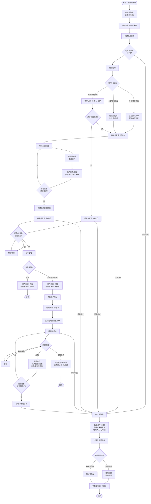

---

## 2. 商品分配流程图

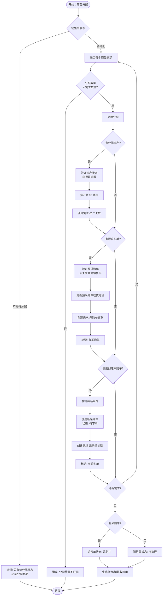

---

## 3. 采购单完成流程图

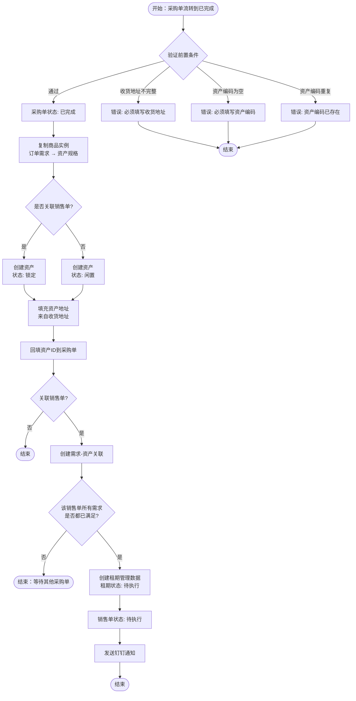

---

## 4. 订单执行流程图

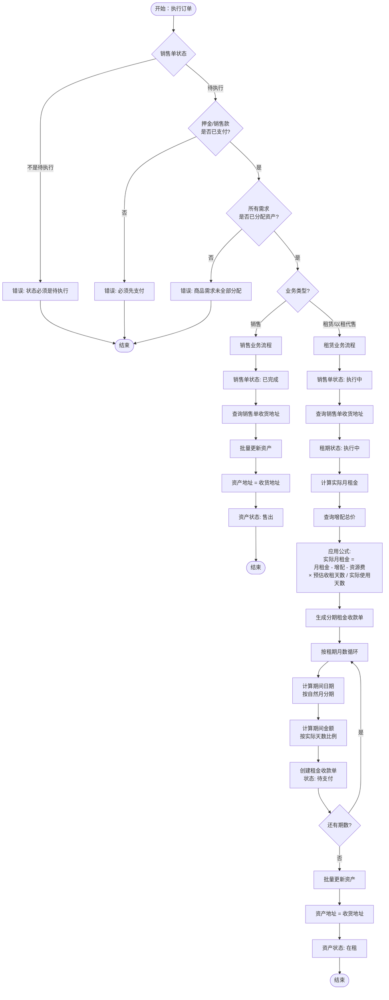

---

## 5. 状态机图

### 5.1 销售单状态流转

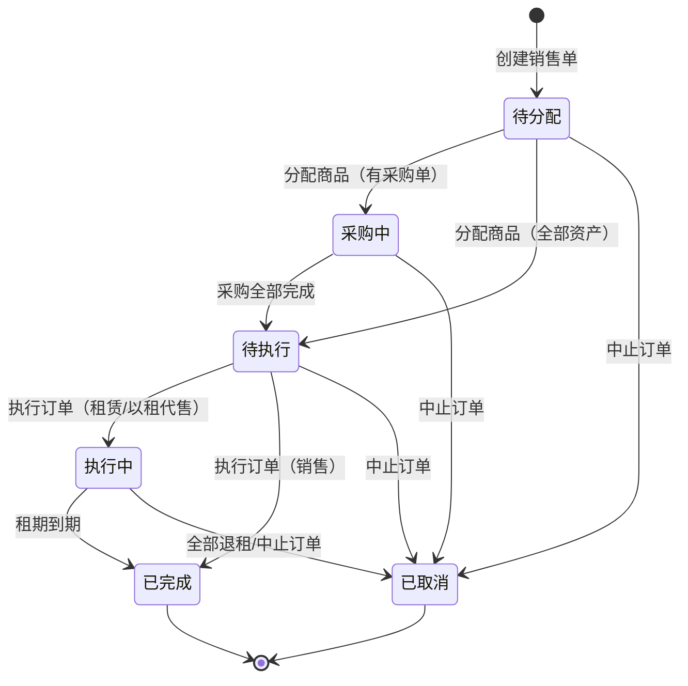

### 5.2 采购单状态流转

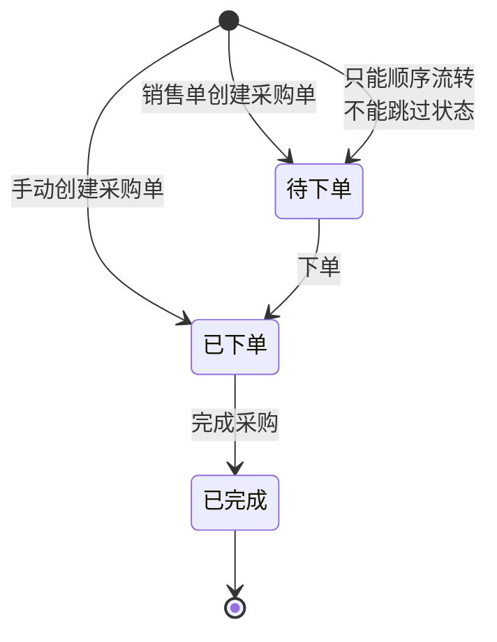

### 5.3 资产状态流转

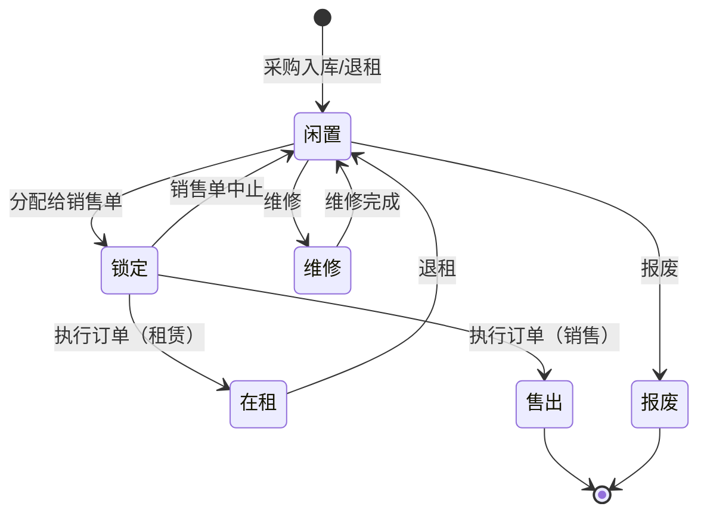

### 5.4 租期状态流转

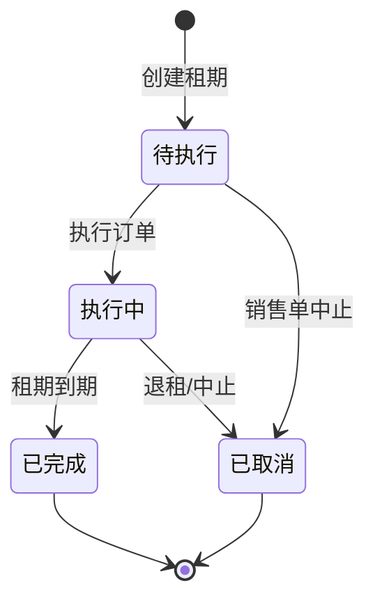

### 5.5 收款单状态流转

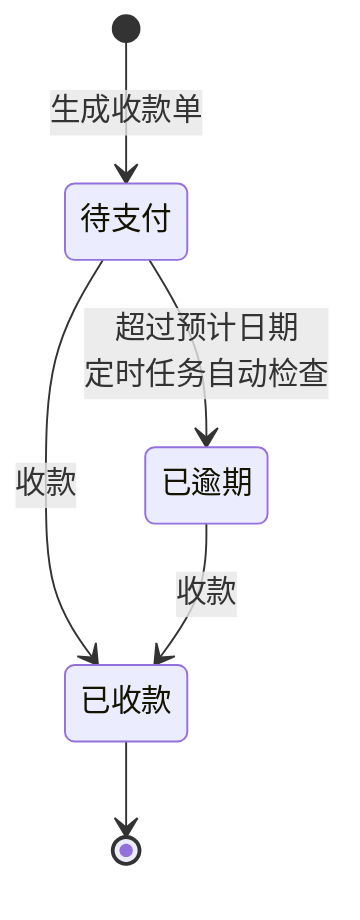

---

## 6. 退租和中止流程图

### 6.1 退租流程

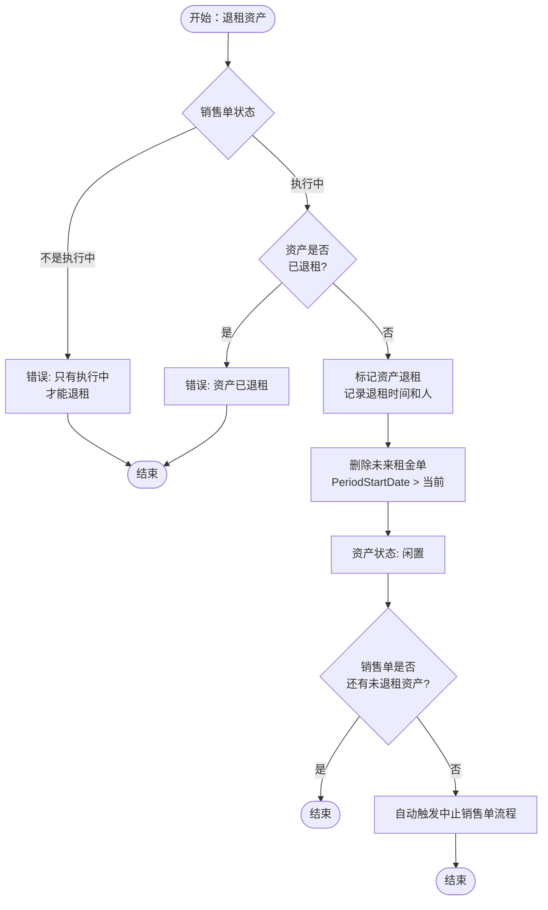

### 6.2 中止销售单流程

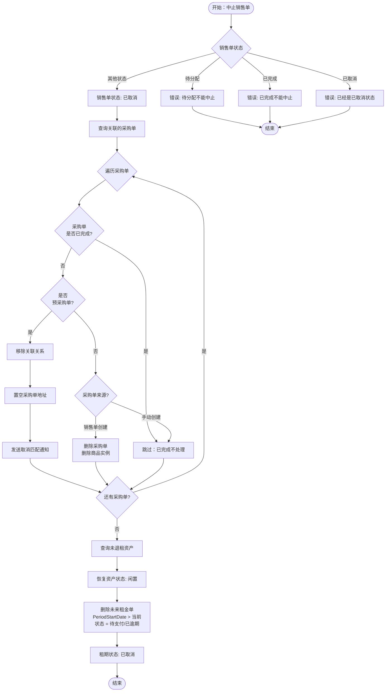

---

## 7. 快照机制流程图

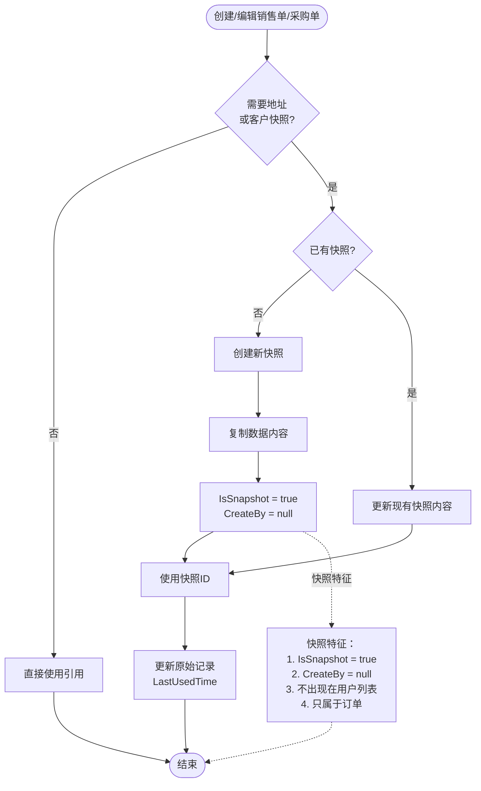

---

## 8. 租金计算流程图

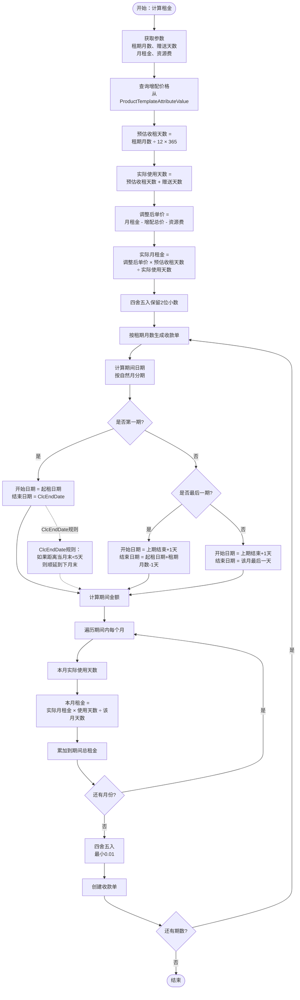

---

## 9. 编号生成流程图

### 9.1 销售单编号生成

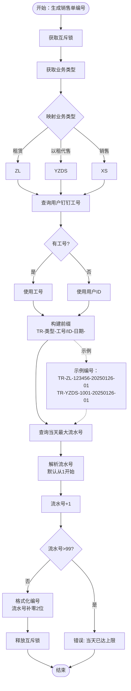

### 9.2 采购单编号生成

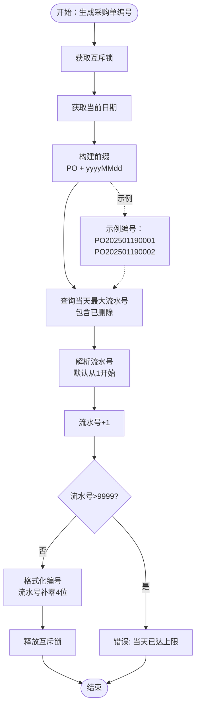

---

## 10. 定时任务流程图

### 10.1 收款单逾期检查

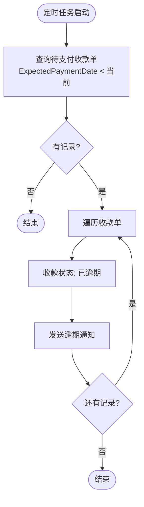

### 10.2 租期到期提醒

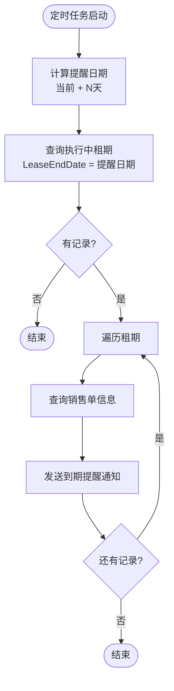

### 10.3 租期到期处理

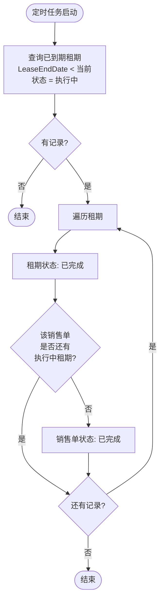

---

## 附录：Mermaid 图表说明

### 流程图符号说明

- `([圆角矩形])`: 开始/结束节点
- `[矩形]`: 处理步骤
- `{菱形}`: 判断节点
- `-->`: 流程箭头
- `-->|文字|`: 带条件的流程箭头

### 状态机符号说明

- `[*]`: 初始/结束状态
- `状态名`: 具体状态
- `-->`: 状态转换
- `note`: 注释说明

### 查看建议

1. 使用支持 Mermaid 的 Markdown 编辑器查看（如 VS Code + Mermaid 插件）
2. 在 GitHub/GitLab 上查看（原生支持 Mermaid）
3. 使用 Typora 等 Markdown 编辑器查看
4. 在线工具：https://mermaid.live/

---

**文档版本**: 1.0  
**最后更新**: 2025-01-26  
**维护人**: 开发团队

