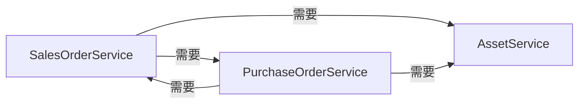

# 采销库存系统 - 架构优化建议

## 目录

- [1. 当前架构分析](#1-当前架构分析)
- [2. 优化方案1：领域事件模式](#2-优化方案1领域事件模式)
- [3. 优化方案2：协调服务模式](#3-优化方案2协调服务模式)
- [4. 优化方案3：MediatR模式](#4-优化方案3mediatr模式)
- [5. 推荐方案](#5-推荐方案)
- [6. 重构路线图](#6-重构路线图)

---

## 1. 当前架构分析

### 1.1 架构现状

系统采用分层架构，核心业务逻辑位于Service层，主要包括：

- **SalesOrderService**：销售单管理
- **PurchaseOrderService**：采购单管理
- **AssetService**：资产管理
- **PaymentRecordService**：收款单管理
- **LeasePeriodService**：租期管理

**架构图**：

```
┌─────────────────────────────────────────────────┐
│              Controller Layer                    │
│   (SalesOrderController, PurchaseOrderController)│
└───────────────┬─────────────────────────────────┘
                │
┌───────────────▼─────────────────────────────────┐
│              Service Layer                       │
│                                                  │
│  ┌──────────────────┐      ┌──────────────────┐│
│  │SalesOrderService │◄────►│PurchaseOrderSvc  ││
│  │                  │      │                  ││
│  │  依赖 IServiceProvider  │  依赖 ISalesOrder││
│  │  延迟解析 IPurchaseSvc   │  Service         ││
│  └────────┬─────────┘      └────────┬─────────┘│
│           │                         │          │
│           │    ┌────────────────────┤          │
│           └───►│   AssetService     │◄─────────┘
│                └────────────────────┘          │
│                                                  │
└──────────────────────────────────────────────────┘
                │
┌───────────────▼─────────────────────────────────┐
│           Repository Layer                       │
│            (SqlSugar ORM)                        │
└──────────────────────────────────────────────────┘
```

---

### 1.2 循环依赖问题

#### 1.2.1 主要依赖关系



**具体依赖场景**：

1. **SalesOrderService → PurchaseOrderService**：
   - 商品分配时创建采购单
   - 需要调用 `AddPurchaseOrder` 方法
   - 代码位置：`SalesOrderService.cs:1275`

2. **PurchaseOrderService → SalesOrderService**：
   - 采购完成后检查销售单状态
   - 需要调用 `TryUpdateToExecutionStatusIfAllDemandsSatisfied` 方法
   - 代码位置：`PurchaseOrderService.cs:1048`

3. **双方都依赖 AssetService**：
   - 销售单执行时更新资产状态
   - 采购完成时创建资产
   - 没有循环问题，但耦合较强

#### 1.2.2 当前解决方案

代码中使用了 **IServiceProvider 延迟解析** 来打破循环依赖：

```csharp
// SalesOrderService.cs
private readonly IServiceProvider _serviceProvider;

public SalesOrderService(..., IServiceProvider serviceProvider)
{
    _serviceProvider = serviceProvider;
}

// 使用时延迟解析
var purchaseOrderService = _serviceProvider.GetService<IPurchaseOrderService>();
purchaseOrderService.AddPurchaseOrder(...);
```

**优点**：
- 简单快速，立即可用
- 不需要修改太多代码
- ASP.NET Core原生支持

**缺点**：
- 隐藏了真实的依赖关系，不利于理解代码
- 延迟解析可能导致运行时错误（编译期无法发现）
- 违反了依赖注入的最佳实践
- 测试时需要提供完整的ServiceProvider

---

### 1.3 问题分析

#### 1.3.1 设计问题

**职责不清**：
- SalesOrderService 承担了太多职责：
  - 销售单的CRUD
  - 商品分配逻辑
  - 创建采购单
  - 更新资产状态
  - 生成收款单
  - 租期管理

**高耦合**：
- 服务之间互相调用，形成网状依赖
- 业务规则分散在多个服务中
- 一个业务流程可能跨越3-4个服务

**可测试性差**：
- 单元测试需要 mock 多个依赖服务
- 集成测试需要启动整个服务容器
- 很难隔离测试单个功能

#### 1.3.2 维护问题

**可读性差**：
- 一个业务流程的代码分散在多个文件
- 阅读代码时需要频繁跳转
- 新人难以理解整体逻辑

**扩展困难**：
- 增加新功能可能影响多个服务
- 修改一个服务的接口可能导致连锁反应
- 重构风险高

**Bug 隐患**：
- 延迟解析可能在运行时失败
- 状态流转逻辑分散，容易遗漏场景
- 事务边界不清晰

---

## 2. 优化方案1：领域事件模式

### 2.1 方案概述

**核心思想**：
- 使用事件驱动架构，解耦服务间的直接依赖
- 每个服务只负责自己的核心业务，通过发布事件通知其他服务
- 事件处理器订阅事件，执行相应的业务逻辑

**架构图**：

```
┌─────────────────────────────────────────────────┐
│              Controller Layer                    │
└───────────────┬─────────────────────────────────┘
                │
┌───────────────▼─────────────────────────────────┐
│              Service Layer                       │
│                                                  │
│  ┌──────────────────┐      ┌──────────────────┐│
│  │SalesOrderService │      │PurchaseOrderSvc  ││
│  │  - 发布事件      │      │  - 发布事件      ││
│  └────────┬─────────┘      └────────┬─────────┘│
│           │                         │          │
│           │  发布     订阅            │  发布    │
│           └──────►EventBus◄──────────┘         │
│                     │                           │
│                     │ 分发                      │
│           ┌─────────┼─────────┐                │
│           │         │         │                │
│     ┌─────▼─┐  ┌───▼────┐ ┌──▼──────┐         │
│     │Handler│  │Handler │ │Handler  │         │
│     └───────┘  └────────┘ └─────────┘         │
└──────────────────────────────────────────────────┘
```

---

### 2.2 实现示例

#### 2.2.1 定义领域事件

```csharp
// ZR.Model/Events/DomainEvent.cs
public abstract class DomainEvent
{
    public DateTime OccurredOn { get; }
    public Guid EventId { get; }

    protected DomainEvent()
    {
        EventId = Guid.NewGuid();
        OccurredOn = DateTime.UtcNow;
    }
}

// ZR.Model/Events/PurchaseOrderCompletedEvent.cs
/// <summary>
/// 采购单完成事件
/// </summary>
public class PurchaseOrderCompletedEvent : DomainEvent
{
    public long PurchaseOrderId { get; set; }
    public long? SalesOrderId { get; set; }
    public long AssetId { get; set; }
    public long DemandId { get; set; }
    
    public PurchaseOrderCompletedEvent(long purchaseOrderId, long? salesOrderId, long assetId, long demandId)
    {
        PurchaseOrderId = purchaseOrderId;
        SalesOrderId = salesOrderId;
        AssetId = assetId;
        DemandId = demandId;
    }
}

// ZR.Model/Events/SalesOrderStatusChangedEvent.cs
/// <summary>
/// 销售单状态变更事件
/// </summary>
public class SalesOrderStatusChangedEvent : DomainEvent
{
    public long SalesOrderId { get; set; }
    public SalesStatus OldStatus { get; set; }
    public SalesStatus NewStatus { get; set; }
    public string ChangeReason { get; set; }
    
    public SalesOrderStatusChangedEvent(long salesOrderId, SalesStatus oldStatus, SalesStatus newStatus, string changeReason)
    {
        SalesOrderId = salesOrderId;
        OldStatus = oldStatus;
        NewStatus = newStatus;
        ChangeReason = changeReason;
    }
}
```

---

#### 2.2.2 事件总线接口

```csharp
// ZR.ServiceCore/EventBus/IEventBus.cs
public interface IEventBus
{
    /// <summary>
    /// 发布事件（同步）
    /// </summary>
    Task PublishAsync<TEvent>(TEvent @event) where TEvent : DomainEvent;
    
    /// <summary>
    /// 订阅事件处理器
    /// </summary>
    void Subscribe<TEvent, THandler>()
        where TEvent : DomainEvent
        where THandler : IEventHandler<TEvent>;
}

// ZR.ServiceCore/EventBus/IEventHandler.cs
public interface IEventHandler<in TEvent> where TEvent : DomainEvent
{
    Task HandleAsync(TEvent @event);
}
```

---

#### 2.2.3 内存事件总线实现

```csharp
// ZR.ServiceCore/EventBus/InMemoryEventBus.cs
public class InMemoryEventBus : IEventBus
{
    private readonly IServiceProvider _serviceProvider;
    private readonly Dictionary<Type, List<Type>> _handlers = new();
    private readonly ILogger<InMemoryEventBus> _logger;

    public InMemoryEventBus(IServiceProvider serviceProvider, ILogger<InMemoryEventBus> logger)
    {
        _serviceProvider = serviceProvider;
        _logger = logger;
    }

    public void Subscribe<TEvent, THandler>()
        where TEvent : DomainEvent
        where THandler : IEventHandler<TEvent>
    {
        var eventType = typeof(TEvent);
        var handlerType = typeof(THandler);

        if (!_handlers.ContainsKey(eventType))
        {
            _handlers[eventType] = new List<Type>();
        }

        if (!_handlers[eventType].Contains(handlerType))
        {
            _handlers[eventType].Add(handlerType);
        }
    }

    public async Task PublishAsync<TEvent>(TEvent @event) where TEvent : DomainEvent
    {
        var eventType = @event.GetType();
        
        if (!_handlers.ContainsKey(eventType))
        {
            _logger.LogWarning($"No handlers registered for event {eventType.Name}");
            return;
        }

        var handlerTypes = _handlers[eventType];
        
        foreach (var handlerType in handlerTypes)
        {
            try
            {
                using var scope = _serviceProvider.CreateScope();
                var handler = scope.ServiceProvider.GetService(handlerType) as IEventHandler<TEvent>;
                
                if (handler != null)
                {
                    await handler.HandleAsync(@event);
                }
            }
            catch (Exception ex)
            {
                _logger.LogError(ex, $"Error handling event {eventType.Name} with handler {handlerType.Name}");
                // 可以选择抛出异常或继续执行其他处理器
            }
        }
    }
}
```

---

#### 2.2.4 事件处理器示例

```csharp
// ZR.Service/Sales/EventHandlers/PurchaseOrderCompletedHandler.cs
[AppService(ServiceType = typeof(IEventHandler<PurchaseOrderCompletedEvent>), ServiceLifetime = LifeTime.Transient)]
public class PurchaseOrderCompletedHandler : IEventHandler<PurchaseOrderCompletedEvent>
{
    private readonly ISalesOrderService _salesOrderService;
    private readonly ILeasePeriodService _leasePeriodService;
    private readonly ILogger<PurchaseOrderCompletedHandler> _logger;

    public PurchaseOrderCompletedHandler(
        ISalesOrderService salesOrderService,
        ILeasePeriodService leasePeriodService,
        ILogger<PurchaseOrderCompletedHandler> logger)
    {
        _salesOrderService = salesOrderService;
        _leasePeriodService = leasePeriodService;
        _logger = logger;
    }

    public async Task HandleAsync(PurchaseOrderCompletedEvent @event)
    {
        if (!@event.SalesOrderId.HasValue)
        {
            _logger.LogInformation($"PurchaseOrder {@event.PurchaseOrderId} has no related SalesOrder, skip handling.");
            return;
        }

        _logger.LogInformation($"Handling PurchaseOrderCompletedEvent for PurchaseOrder {@event.PurchaseOrderId}, SalesOrder {@event.SalesOrderId}");

        // 检查销售单是否所有需求都已满足
        bool allDemandsSatisfied = _salesOrderService.TryUpdateToExecutionStatusIfAllDemandsSatisfied(@event.SalesOrderId.Value);

        if (allDemandsSatisfied)
        {
            _logger.LogInformation($"All demands satisfied for SalesOrder {@event.SalesOrderId}, creating lease periods.");
            
            // 创建租期管理数据
            _leasePeriodService.CreateLeasePeriodsForSalesOrder(@event.SalesOrderId.Value);
        }
    }
}
```

---

#### 2.2.5 修改PurchaseOrderService发布事件

```csharp
// ZR.Service/Purchase/PurchaseOrderService.cs
public class PurchaseOrderService : BaseService<PurchaseOrder>, IPurchaseOrderService
{
    private readonly IEventBus _eventBus;
    
    public PurchaseOrderService(..., IEventBus eventBus)
    {
        _eventBus = eventBus;
    }

    public int UpdatePurchaseOrderStatus(long purchaseOrderId, PurchaseStatus newStatus, string changeReason)
    {
        var result = Context.Ado.UseTran(() =>
        {
            // ... 原有的状态更新逻辑 ...
            
            // 9. 如果采购单有关联的销售单需求，创建资产-需求关联
            var demandRelation = Context.Queryable<ProductDemandPurchaseOrderRelation>()
                .Where(r => r.PurchaseOrderId == purchaseOrderId)
                .Select(r => new { r.DemandId, r.SalesOrderId, r.SalesOrderCode })
                .First();

            if (demandRelation != null)
            {
                // ... 创建资产关联 ...
                
                // 发布采购单完成事件（不再直接调用 SalesOrderService）
                var completedEvent = new PurchaseOrderCompletedEvent(
                    purchaseOrderId,
                    demandRelation.SalesOrderId,
                    newAsset.AssetId,
                    demandRelation.DemandId
                );
                
                // 在事务外发布事件
                Task.Run(() => _eventBus.PublishAsync(completedEvent));
            }
            
            return 1;
        });

        return result.IsSuccess ? result.Data : 0;
    }
}
```

---

#### 2.2.6 注册事件总线和处理器

```csharp
// Program.cs 或 Startup.cs
public void ConfigureServices(IServiceCollection services)
{
    // 注册事件总线
    services.AddSingleton<IEventBus, InMemoryEventBus>();
    
    // 注册所有事件处理器（自动扫描）
    var handlerTypes = Assembly.GetExecutingAssembly()
        .GetTypes()
        .Where(t => t.GetInterfaces()
            .Any(i => i.IsGenericType && i.GetGenericTypeDefinition() == typeof(IEventHandler<>)))
        .ToList();
    
    foreach (var handlerType in handlerTypes)
    {
        var interfaces = handlerType.GetInterfaces()
            .Where(i => i.IsGenericType && i.GetGenericTypeDefinition() == typeof(IEventHandler<>));
        
        foreach (var @interface in interfaces)
        {
            services.AddTransient(@interface, handlerType);
        }
    }
    
    // 或者手动注册
    // services.AddTransient<IEventHandler<PurchaseOrderCompletedEvent>, PurchaseOrderCompletedHandler>();
}
```

---

### 2.3 优缺点分析

#### 优点

1. **解耦服务依赖**：
   - 服务之间不再直接依赖
   - 通过事件进行通信
   - 易于理解和维护

2. **易于扩展**：
   - 新增事件处理器不影响原有代码
   - 一个事件可以有多个处理器
   - 支持跨模块通信

3. **可测试性强**：
   - 服务只需测试事件的发布
   - 事件处理器可以独立测试
   - Mock 依赖更简单

4. **符合开闭原则**：
   - 对扩展开放（新增处理器）
   - 对修改封闭（不改原有代码）

5. **清晰的业务流程**：
   - 事件名称描述业务动作
   - 便于理解系统行为
   - 有助于文档和沟通

#### 缺点

1. **异步复杂性**：
   - 事件处理是异步的，增加了复杂度
   - 需要考虑事件顺序和并发问题
   - 错误处理更困难

2. **调试困难**：
   - 调用链不直观，难以跟踪
   - 需要日志记录事件流转
   - IDE的"跳转到定义"无法使用

3. **事务一致性**：
   - 事件发布和业务操作可能不在同一事务
   - 需要考虑事件发布失败的情况
   - 可能需要引入事件溯源或补偿机制

4. **性能开销**：
   - 事件分发有一定性能损耗
   - 大量事件可能影响系统性能
   - 需要考虑事件持久化和重试

5. **学习成本**：
   - 团队需要理解事件驱动架构
   - 新手可能不适应异步思维
   - 需要建立最佳实践规范

---

### 2.4 适用场景

**适合使用**：
- 业务流程复杂，跨多个模块
- 需要频繁扩展新功能
- 团队规模较大，模块独立开发
- 对可扩展性要求高

**不适合使用**：
- 简单的CRUD应用
- 实时性要求极高的场景
- 团队对异步编程不熟悉
- 项目规模小，维护人员少

---

## 3. 优化方案2：协调服务模式

### 3.1 方案概述

**核心思想**：
- 引入协调服务（Orchestrator）统一管理跨服务的业务流程
- 各个领域服务只负责自己模块的核心业务
- 协调服务负责编排和调用多个领域服务

**架构图**：

```
┌─────────────────────────────────────────────────┐
│              Controller Layer                    │
└───────────────┬─────────────────────────────────┘
                │
┌───────────────▼─────────────────────────────────┐
│          Orchestrator Layer                      │
│  ┌────────────────────────────────────────────┐ │
│  │       OrderCoordinatorService              │ │
│  │  - SubmitProductAllocation                 │ │
│  │  - ExecuteSalesOrder                       │ │
│  │  - CompletePurchaseOrder                   │ │
│  └─┬──────┬──────┬──────┬──────────────────────┘ │
└────┼──────┼──────┼──────┼──────────────────────┘
     │      │      │      │
┌────▼──────▼──────▼──────▼──────────────────────┐
│              Service Layer                       │
│                                                  │
│  ┌──────────────┐ ┌──────────────┐ ┌─────────┐│
│  │SalesOrderSvc │ │PurchaseOrderSvc│ │AssetSvc ││
│  │  - 纯业务逻辑│ │  - 纯业务逻辑 │ │- 纯业务逻辑││
│  │  - 无跨服务调用│ │  - 无跨服务调用│ │- 无跨服务调用││
│  └──────────────┘ └──────────────┘ └─────────┘│
└──────────────────────────────────────────────────┘
```

---

### 3.2 实现示例

#### 3.2.1 定义协调服务接口

```csharp
// ZR.Service/Orchestrator/IOrderCoordinatorService.cs
/// <summary>
/// 订单协调服务接口
/// 负责协调销售单、采购单、资产之间的业务流程
/// </summary>
public interface IOrderCoordinatorService
{
    /// <summary>
    /// 提交商品分配
    /// 协调销售单、资产、采购单的分配流程
    /// </summary>
    Task<int> SubmitProductAllocationAsync(SubmitAllocationRequestDto request);
    
    /// <summary>
    /// 采购单完成处理
    /// 协调采购单完成后的资产创建和销售单状态更新
    /// </summary>
    Task<AssetCreationResult> HandlePurchaseOrderCompletionAsync(long purchaseOrderId);
    
    /// <summary>
    /// 执行销售单
    /// 协调销售单执行的完整流程（资产状态更新、租金生成等）
    /// </summary>
    Task<int> ExecuteSalesOrderAsync(long salesOrderId);
    
    /// <summary>
    /// 退租资产
    /// 协调退租的完整流程（资产状态、租金单、销售单状态）
    /// </summary>
    Task<int> ReturnAssetAsync(long salesOrderId, long assetId);
    
    /// <summary>
    /// 中止销售单
    /// 协调中止的完整流程（采购单处理、资产恢复、租期取消）
    /// </summary>
    Task<int> CancelSalesOrderAsync(long salesOrderId);
}
```

---

#### 3.2.2 实现协调服务

```csharp
// ZR.Service/Orchestrator/OrderCoordinatorService.cs
[AppService(ServiceType = typeof(IOrderCoordinatorService), ServiceLifetime = LifeTime.Transient)]
public class OrderCoordinatorService : IOrderCoordinatorService
{
    private readonly ISalesOrderService _salesOrderService;
    private readonly IPurchaseOrderService _purchaseOrderService;
    private readonly IAssetService _assetService;
    private readonly ILeasePeriodService _leasePeriodService;
    private readonly IPaymentRecordService _paymentRecordService;
    private readonly IProductInstanceService _productInstanceService;
    private readonly IDingTalkNotificationService _dingTalkNotificationService;
    private readonly ILogger<OrderCoordinatorService> _logger;

    public OrderCoordinatorService(
        ISalesOrderService salesOrderService,
        IPurchaseOrderService purchaseOrderService,
        IAssetService assetService,
        ILeasePeriodService leasePeriodService,
        IPaymentRecordService paymentRecordService,
        IProductInstanceService productInstanceService,
        IDingTalkNotificationService dingTalkNotificationService,
        ILogger<OrderCoordinatorService> logger)
    {
        _salesOrderService = salesOrderService;
        _purchaseOrderService = purchaseOrderService;
        _assetService = assetService;
        _leasePeriodService = leasePeriodService;
        _paymentRecordService = paymentRecordService;
        _productInstanceService = productInstanceService;
        _dingTalkNotificationService = dingTalkNotificationService;
        _logger = logger;
    }

    /// <summary>
    /// 提交商品分配
    /// </summary>
    public async Task<int> SubmitProductAllocationAsync(SubmitAllocationRequestDto request)
    {
        _logger.LogInformation($"Starting product allocation for SalesOrder {request.SalesOrderId}");

        // 1. 验证销售单状态
        var salesOrder = await _salesOrderService.GetSalesOrderAsync(request.SalesOrderId);
        if (salesOrder.SalesStatus != SalesStatus.PendingAllocation)
        {
            throw new CustomException("只有待分配状态的销售单才能进行商品分配");
        }

        bool hasPurchaseOrders = false;

        // 2. 处理每个需求的分配
        foreach (var allocation in request.DemandAllocations)
        {
            // 2.1 验证分配数量
            var demand = await _salesOrderService.GetDemandAsync(allocation.DemandId);
            var totalAllocated = (allocation.AllocatedAssets?.Count ?? 0) 
                + (allocation.AllocatedPurchaseOrders?.Count ?? 0) 
                + allocation.CreatePurchaseOrderCount;
            
            if (totalAllocated != demand.RequiredQuantity)
            {
                throw new CustomException($"商品需求的分配数量({totalAllocated})与需求数量({demand.RequiredQuantity})不一致");
            }

            // 2.2 分配资产
            if (allocation.AllocatedAssets != null && allocation.AllocatedAssets.Count > 0)
            {
                foreach (var assetId in allocation.AllocatedAssets)
                {
                    await _assetService.AllocateAssetToSalesOrderAsync(
                        assetId, 
                        request.SalesOrderId, 
                        allocation.DemandId);
                }
            }

            // 2.3 关联预采购单
            if (allocation.AllocatedPurchaseOrders != null && allocation.AllocatedPurchaseOrders.Count > 0)
            {
                hasPurchaseOrders = true;
                foreach (var purchaseOrderId in allocation.AllocatedPurchaseOrders)
                {
                    await _purchaseOrderService.LinkToSalesOrderAsync(
                        purchaseOrderId, 
                        request.SalesOrderId, 
                        allocation.DemandId,
                        salesOrder.DeliveryAddressId);
                }
            }

            // 2.4 创建新采购单
            if (allocation.CreatePurchaseOrderCount > 0)
            {
                hasPurchaseOrders = true;
                await _purchaseOrderService.CreatePurchaseOrdersForSalesOrderAsync(
                    request.SalesOrderId,
                    allocation.DemandId,
                    allocation.CreatePurchaseOrderCount,
                    salesOrder.DeliveryAddressId);
            }
        }

        // 3. 更新销售单状态
        var newStatus = hasPurchaseOrders ? SalesStatus.Purchasing : SalesStatus.PendingExecution;
        await _salesOrderService.UpdateStatusAsync(
            request.SalesOrderId, 
            newStatus, 
            hasPurchaseOrders ? "关联采购单，进入采购中" : "全部分配资产，进入待执行");

        // 4. 生成收款单
        await _paymentRecordService.GenerateDepositOrSalePaymentAsync(request.SalesOrderId, salesOrder.BusinessType);

        _logger.LogInformation($"Product allocation completed for SalesOrder {request.SalesOrderId}, new status: {newStatus}");

        return 1;
    }

    /// <summary>
    /// 采购单完成处理
    /// </summary>
    public async Task<AssetCreationResult> HandlePurchaseOrderCompletionAsync(long purchaseOrderId)
    {
        _logger.LogInformation($"Handling PurchaseOrder completion: {purchaseOrderId}");

        // 1. 获取采购单信息
        var purchaseOrder = await _purchaseOrderService.GetPurchaseOrderAsync(purchaseOrderId);

        // 2. 创建资产
        var asset = await _assetService.CreateAssetFromPurchaseOrderAsync(purchaseOrder);

        // 3. 回填资产ID到采购单
        await _purchaseOrderService.UpdateAssetIdAsync(purchaseOrderId, asset.AssetId);

        // 4. 如果关联销售单，创建需求-资产关联
        long? salesOrderId = null;
        if (purchaseOrder.RelatedSalesOrderId.HasValue)
        {
            salesOrderId = purchaseOrder.RelatedSalesOrderId.Value;
            await _salesOrderService.CreateDemandAssetRelationAsync(
                salesOrderId.Value,
                purchaseOrder.RelatedDemandId.Value,
                asset.AssetId);

            // 5. 检查销售单是否所有需求都已满足
            bool allDemandsSatisfied = await _salesOrderService.CheckAllDemandsSatisfiedAsync(salesOrderId.Value);
            
            if (allDemandsSatisfied)
            {
                _logger.LogInformation($"All demands satisfied for SalesOrder {salesOrderId}, creating lease periods and updating status");

                // 5.1 创建租期管理数据
                await _leasePeriodService.CreateLeasePeriodsForSalesOrderAsync(salesOrderId.Value);

                // 5.2 更新销售单状态为待执行
                await _salesOrderService.UpdateStatusAsync(
                    salesOrderId.Value, 
                    SalesStatus.PendingExecution, 
                    "所有商品需求已匹配完成");

                // 5.3 发送通知
                await _dingTalkNotificationService.SendSalesOrderReadyNotificationAsync(salesOrderId.Value);
            }
        }

        _logger.LogInformation($"PurchaseOrder {purchaseOrderId} completion handled, Asset {asset.AssetId} created");

        return new AssetCreationResult
        {
            AssetId = asset.AssetId,
            SalesOrderId = salesOrderId,
            AllDemandsSatisfied = salesOrderId.HasValue && await _salesOrderService.CheckAllDemandsSatisfiedAsync(salesOrderId.Value)
        };
    }

    // ... 其他方法类似实现 ...
}
```

---

#### 3.2.3 简化领域服务

```csharp
// ZR.Service/Sales/SalesOrderService.cs（简化后）
public class SalesOrderService : BaseService<SalesOrder>, ISalesOrderService
{
    // 移除对 IPurchaseOrderService 和 IServiceProvider 的依赖
    
    /// <summary>
    /// 创建销售单（纯业务逻辑，不涉及跨服务调用）
    /// </summary>
    public async Task<SalesOrder> CreateSalesOrderAsync(SalesOrder model)
    {
        // 只负责销售单自身的创建逻辑
        // 快照创建、商品需求创建、状态日志等
        // 不再创建采购单或分配资产
    }
    
    /// <summary>
    /// 更新销售单状态（纯状态管理，由协调服务调用）
    /// </summary>
    public async Task UpdateStatusAsync(long salesOrderId, SalesStatus newStatus, string changeReason)
    {
        // 只负责状态更新和日志记录
        // 不触发其他业务逻辑
    }
    
    /// <summary>
    /// 检查所有需求是否满足（查询方法，供协调服务使用）
    /// </summary>
    public async Task<bool> CheckAllDemandsSatisfiedAsync(long salesOrderId)
    {
        // 纯查询逻辑，不修改状态
    }
    
    /// <summary>
    /// 创建需求-资产关联（数据操作，由协调服务调用）
    /// </summary>
    public async Task CreateDemandAssetRelationAsync(long salesOrderId, long demandId, long assetId)
    {
        // 纯数据操作，不涉及业务流程
    }
}

// ZR.Service/Purchase/PurchaseOrderService.cs（简化后）
public class PurchaseOrderService : BaseService<PurchaseOrder>, IPurchaseOrderService
{
    // 移除对 ISalesOrderService 的依赖
    
    /// <summary>
    /// 更新采购单状态（纯状态管理，由协调服务调用）
    /// </summary>
    public async Task UpdateStatusAsync(long purchaseOrderId, PurchaseStatus newStatus, string changeReason)
    {
        // 只负责状态更新和日志记录
        // 不调用 SalesOrderService
    }
    
    /// <summary>
    /// 关联到销售单（数据操作，由协调服务调用）
    /// </summary>
    public async Task LinkToSalesOrderAsync(long purchaseOrderId, long salesOrderId, long demandId, long deliveryAddressId)
    {
        // 纯数据操作，更新地址和关联关系
    }
}
```

---

#### 3.2.4 修改Controller调用协调服务

```csharp
// ZR.Admin.WebApi/Controllers/SalesOrderController.cs
[ApiController]
[Route("[controller]")]
public class SalesOrderController : BaseController
{
    private readonly ISalesOrderService _salesOrderService;
    private readonly IOrderCoordinatorService _orderCoordinator;

    public SalesOrderController(
        ISalesOrderService salesOrderService,
        IOrderCoordinatorService orderCoordinator)
    {
        _salesOrderService = salesOrderService;
        _orderCoordinator = orderCoordinator;
    }

    /// <summary>
    /// 提交商品分配
    /// </summary>
    [HttpPost("SubmitAllocation")]
    public async Task<IActionResult> SubmitAllocation([FromBody] SubmitAllocationRequestDto request)
    {
        // 调用协调服务而不是领域服务
        var result = await _orderCoordinator.SubmitProductAllocationAsync(request);
        return SUCCESS(result);
    }

    /// <summary>
    /// 执行订单
    /// </summary>
    [HttpPost("Execute/{salesOrderId}")]
    public async Task<IActionResult> ExecuteSalesOrder(long salesOrderId)
    {
        // 调用协调服务
        var result = await _orderCoordinator.ExecuteSalesOrderAsync(salesOrderId);
        return SUCCESS(result);
    }
}
```

---

### 3.3 优缺点分析

#### 优点

1. **清晰的职责划分**：
   - 领域服务：专注核心业务逻辑
   - 协调服务：专注流程编排
   - Controller：专注接口定义

2. **易于理解**：
   - 业务流程集中在协调服务
   - 调用链清晰，便于调试
   - 新人容易上手

3. **可测试性强**：
   - 领域服务可以独立测试
   - 协调服务测试验证流程编排
   - Mock 依赖简单

4. **易于维护**：
   - 修改业务流程只需修改协调服务
   - 领域服务稳定性高
   - 重构风险低

5. **符合单一职责原则**：
   - 每个服务职责明确
   - 不会出现"上帝类"

#### 缺点

1. **协调服务可能变复杂**：
   - 所有流程都在协调服务中
   - 可能成为新的"上帝类"
   - 需要合理拆分

2. **代码量增加**：
   - 增加了协调服务层
   - 接口和方法数量增多
   - 维护成本提高

3. **性能开销**：
   - 多一层服务调用
   - 可能影响性能（通常可忽略）

4. **领域模型弱化**：
   - 领域服务变成纯数据操作
   - 业务逻辑集中在协调服务
   - 不符合DDD思想

5. **需要重构现有代码**：
   - 需要大量修改现有服务
   - 迁移成本高
   - 风险较大

---

### 3.4 适用场景

**适合使用**：
- 业务流程明确且相对固定
- 团队对同步编程更熟悉
- 希望快速重构现有代码
- 对性能要求不高

**不适合使用**：
- 业务流程经常变化
- 需要支持高度定制化
- 微服务架构（协调服务会成为瓶颈）
- 对扩展性要求极高

---

## 4. 优化方案3：MediatR模式

### 4.1 方案概述

**核心思想**：
- 使用命令/查询职责分离（CQRS）模式
- 命令和查询通过中介者（Mediator）传递
- 请求处理器负责具体的业务逻辑
- 支持管道行为（Pipeline Behaviors）处理横切关注点

**架构图**：

```
┌─────────────────────────────────────────────────┐
│              Controller Layer                    │
│  - 发送 Command/Query 到 Mediator              │
└───────────────┬─────────────────────────────────┘
                │
┌───────────────▼─────────────────────────────────┐
│              MediatR                             │
│                                                  │
│  ┌──────────────────────────────────────────┐  │
│  │            Pipeline Behaviors            │  │
│  │  - Logging                               │  │
│  │  - Validation                            │  │
│  │  - Transaction                           │  │
│  └──────────┬───────────────────────────────┘  │
│             │                                   │
│  ┌──────────▼───────────────────────────────┐  │
│  │         Request Handlers                 │  │
│  │                                          │  │
│  │  ┌────────────────┐  ┌────────────────┐ │  │
│  │  │Command Handler │  │Query Handler   │ │  │
│  │  └────────┬───────┘  └────────┬───────┘ │  │
│  └───────────┼───────────────────┼─────────┘  │
└──────────────┼───────────────────┼─────────────┘
               │                   │
┌──────────────▼───────────────────▼─────────────┐
│              Service Layer                       │
│  - 纯业务逻辑，由Handler调用                   │
└──────────────────────────────────────────────────┘
```

---

### 4.2 实现示例

#### 4.2.1 安装MediatR包

```bash
dotnet add package MediatR
dotnet add package MediatR.Extensions.Microsoft.DependencyInjection
```

---

#### 4.2.2 定义命令和查询

```csharp
// ZR.Model/Commands/SubmitProductAllocationCommand.cs
/// <summary>
/// 提交商品分配命令
/// </summary>
public class SubmitProductAllocationCommand : IRequest<int>
{
    public long SalesOrderId { get; set; }
    public List<DemandAllocationDto> DemandAllocations { get; set; }
}

// ZR.Model/Commands/CompletePurchaseOrderCommand.cs
/// <summary>
/// 完成采购单命令
/// </summary>
public class CompletePurchaseOrderCommand : IRequest<AssetCreationResult>
{
    public long PurchaseOrderId { get; set; }
    public string ChangeReason { get; set; }
}

// ZR.Model/Queries/GetSalesOrderQuery.cs
/// <summary>
/// 查询销售单详情
/// </summary>
public class GetSalesOrderQuery : IRequest<SalesOrderDto>
{
    public long SalesOrderId { get; set; }
}
```

---

#### 4.2.3 实现命令处理器

```csharp
// ZR.Service/CommandHandlers/SubmitProductAllocationHandler.cs
public class SubmitProductAllocationHandler : IRequestHandler<SubmitProductAllocationCommand, int>
{
    private readonly ISalesOrderService _salesOrderService;
    private readonly IPurchaseOrderService _purchaseOrderService;
    private readonly IAssetService _assetService;
    private readonly IPaymentRecordService _paymentRecordService;
    private readonly ILogger<SubmitProductAllocationHandler> _logger;

    public SubmitProductAllocationHandler(
        ISalesOrderService salesOrderService,
        IPurchaseOrderService purchaseOrderService,
        IAssetService assetService,
        IPaymentRecordService paymentRecordService,
        ILogger<SubmitProductAllocationHandler> logger)
    {
        _salesOrderService = salesOrderService;
        _purchaseOrderService = purchaseOrderService;
        _assetService = assetService;
        _paymentRecordService = paymentRecordService;
        _logger = logger;
    }

    public async Task<int> Handle(SubmitProductAllocationCommand request, CancellationToken cancellationToken)
    {
        _logger.LogInformation($"Handling SubmitProductAllocationCommand for SalesOrder {request.SalesOrderId}");

        // 处理商品分配的业务逻辑
        // （类似协调服务的实现）
        
        return 1;
    }
}

// ZR.Service/CommandHandlers/CompletePurchaseOrderHandler.cs
public class CompletePurchaseOrderHandler : IRequestHandler<CompletePurchaseOrderCommand, AssetCreationResult>
{
    private readonly IPurchaseOrderService _purchaseOrderService;
    private readonly IAssetService _assetService;
    private readonly ISalesOrderService _salesOrderService;
    private readonly ILeasePeriodService _leasePeriodService;
    private readonly IMediator _mediator;  // 可以发送其他命令
    private readonly ILogger<CompletePurchaseOrderHandler> _logger;

    public CompletePurchaseOrderHandler(
        IPurchaseOrderService purchaseOrderService,
        IAssetService assetService,
        ISalesOrderService salesOrderService,
        ILeasePeriodService leasePeriodService,
        IMediator mediator,
        ILogger<CompletePurchaseOrderHandler> logger)
    {
        _purchaseOrderService = purchaseOrderService;
        _assetService = assetService;
        _salesOrderService = salesOrderService;
        _leasePeriodService = leasePeriodService;
        _mediator = mediator;
        _logger = logger;
    }

    public async Task<AssetCreationResult> Handle(CompletePurchaseOrderCommand request, CancellationToken cancellationToken)
    {
        _logger.LogInformation($"Handling CompletePurchaseOrderCommand for PurchaseOrder {request.PurchaseOrderId}");

        // 1. 更新采购单状态
        await _purchaseOrderService.UpdateStatusAsync(
            request.PurchaseOrderId, 
            PurchaseStatus.Completed, 
            request.ChangeReason);

        // 2. 创建资产
        var purchaseOrder = await _purchaseOrderService.GetPurchaseOrderAsync(request.PurchaseOrderId);
        var asset = await _assetService.CreateAssetFromPurchaseOrderAsync(purchaseOrder);

        // 3. 回填资产ID
        await _purchaseOrderService.UpdateAssetIdAsync(request.PurchaseOrderId, asset.AssetId);

        // 4. 如果关联销售单，触发后续流程
        if (purchaseOrder.RelatedSalesOrderId.HasValue)
        {
            await _salesOrderService.CreateDemandAssetRelationAsync(
                purchaseOrder.RelatedSalesOrderId.Value,
                purchaseOrder.RelatedDemandId.Value,
                asset.AssetId);

            // 检查是否所有需求都已满足
            bool allSatisfied = await _salesOrderService.CheckAllDemandsSatisfiedAsync(
                purchaseOrder.RelatedSalesOrderId.Value);

            if (allSatisfied)
            {
                // 可以发送另一个命令处理后续流程
                await _mediator.Send(new UpdateSalesOrderToExecutionCommand
                {
                    SalesOrderId = purchaseOrder.RelatedSalesOrderId.Value
                }, cancellationToken);
            }

            return new AssetCreationResult
            {
                AssetId = asset.AssetId,
                SalesOrderId = purchaseOrder.RelatedSalesOrderId,
                AllDemandsSatisfied = allSatisfied
            };
        }

        return new AssetCreationResult
        {
            AssetId = asset.AssetId,
            SalesOrderId = null,
            AllDemandsSatisfied = false
        };
    }
}
```

---

#### 4.2.4 实现管道行为

```csharp
// ZR.ServiceCore/Behaviors/LoggingBehavior.cs
/// <summary>
/// 日志管道行为
/// </summary>
public class LoggingBehavior<TRequest, TResponse> : IPipelineBehavior<TRequest, TResponse>
    where TRequest : IRequest<TResponse>
{
    private readonly ILogger<LoggingBehavior<TRequest, TResponse>> _logger;

    public LoggingBehavior(ILogger<LoggingBehavior<TRequest, TResponse>> logger)
    {
        _logger = logger;
    }

    public async Task<TResponse> Handle(TRequest request, RequestHandlerDelegate<TResponse> next, CancellationToken cancellationToken)
    {
        var requestName = typeof(TRequest).Name;
        _logger.LogInformation($"Handling {requestName}");

        var stopwatch = System.Diagnostics.Stopwatch.StartNew();
        
        try
        {
            var response = await next();
            
            stopwatch.Stop();
            _logger.LogInformation($"Handled {requestName} in {stopwatch.ElapsedMilliseconds}ms");
            
            return response;
        }
        catch (Exception ex)
        {
            stopwatch.Stop();
            _logger.LogError(ex, $"Error handling {requestName} after {stopwatch.ElapsedMilliseconds}ms");
            throw;
        }
    }
}

// ZR.ServiceCore/Behaviors/ValidationBehavior.cs
/// <summary>
/// 验证管道行为（需要配合FluentValidation使用）
/// </summary>
public class ValidationBehavior<TRequest, TResponse> : IPipelineBehavior<TRequest, TResponse>
    where TRequest : IRequest<TResponse>
{
    private readonly IEnumerable<IValidator<TRequest>> _validators;

    public ValidationBehavior(IEnumerable<IValidator<TRequest>> validators)
    {
        _validators = validators;
    }

    public async Task<TResponse> Handle(TRequest request, RequestHandlerDelegate<TResponse> next, CancellationToken cancellationToken)
    {
        if (_validators.Any())
        {
            var context = new ValidationContext<TRequest>(request);
            
            var validationResults = await Task.WhenAll(
                _validators.Select(v => v.ValidateAsync(context, cancellationToken)));
            
            var failures = validationResults
                .SelectMany(r => r.Errors)
                .Where(f => f != null)
                .ToList();

            if (failures.Count != 0)
            {
                throw new ValidationException(failures);
            }
        }
        
        return await next();
    }
}

// ZR.ServiceCore/Behaviors/TransactionBehavior.cs
/// <summary>
/// 事务管道行为
/// </summary>
public class TransactionBehavior<TRequest, TResponse> : IPipelineBehavior<TRequest, TResponse>
    where TRequest : IRequest<TResponse>
{
    private readonly ISqlSugarClient _db;
    private readonly ILogger<TransactionBehavior<TRequest, TResponse>> _logger;

    public TransactionBehavior(ISqlSugarClient db, ILogger<TransactionBehavior<TRequest, TResponse>> logger)
    {
        _db = db;
        _logger = logger;
    }

    public async Task<TResponse> Handle(TRequest request, RequestHandlerDelegate<TResponse> next, CancellationToken cancellationToken)
    {
        var requestName = typeof(TRequest).Name;
        
        // 只对命令使用事务（查询不需要）
        if (!requestName.EndsWith("Command"))
        {
            return await next();
        }

        _logger.LogInformation($"Begin transaction for {requestName}");

        try
        {
            _db.Ado.BeginTran();
            var response = await next();
            _db.Ado.CommitTran();
            
            _logger.LogInformation($"Commit transaction for {requestName}");
            return response;
        }
        catch (Exception ex)
        {
            _db.Ado.RollbackTran();
            _logger.LogError(ex, $"Rollback transaction for {requestName}");
            throw;
        }
    }
}
```

---

#### 4.2.5 注册MediatR和管道行为

```csharp
// Program.cs 或 Startup.cs
public void ConfigureServices(IServiceCollection services)
{
    // 注册MediatR（自动扫描当前程序集的所有Handler）
    services.AddMediatR(cfg =>
    {
        cfg.RegisterServicesFromAssembly(Assembly.GetExecutingAssembly());
        
        // 注册管道行为（按顺序执行）
        cfg.AddBehavior<IPipelineBehavior<object, object>, LoggingBehavior<object, object>>();
        cfg.AddBehavior<IPipelineBehavior<object, object>, ValidationBehavior<object, object>>();
        cfg.AddBehavior<IPipelineBehavior<object, object>, TransactionBehavior<object, object>>();
    });
}
```

---

#### 4.2.6 Controller使用MediatR

```csharp
// ZR.Admin.WebApi/Controllers/SalesOrderController.cs
[ApiController]
[Route("[controller]")]
public class SalesOrderController : BaseController
{
    private readonly IMediator _mediator;

    public SalesOrderController(IMediator mediator)
    {
        _mediator = mediator;
    }

    /// <summary>
    /// 提交商品分配
    /// </summary>
    [HttpPost("SubmitAllocation")]
    public async Task<IActionResult> SubmitAllocation([FromBody] SubmitProductAllocationCommand command)
    {
        // 直接发送命令到Mediator
        var result = await _mediator.Send(command);
        return SUCCESS(result);
    }

    /// <summary>
    /// 查询销售单详情
    /// </summary>
    [HttpGet("{salesOrderId}")]
    public async Task<IActionResult> GetSalesOrder(long salesOrderId)
    {
        // 发送查询到Mediator
        var query = new GetSalesOrderQuery { SalesOrderId = salesOrderId };
        var result = await _mediator.Send(query);
        return SUCCESS(result);
    }
}
```

---

### 4.3 优缺点分析

#### 优点

1. **命令查询分离**：
   - 命令和查询职责明确
   - 易于优化和扩展
   - 符合CQRS思想

2. **管道行为强大**：
   - 横切关注点集中处理
   - 代码复用性高
   - 易于添加新行为

3. **解耦Controller和Service**：
   - Controller不依赖具体服务
   - 易于测试
   - 接口稳定

4. **易于扩展**：
   - 新增命令/查询不影响现有代码
   - Handler独立开发
   - 符合开闭原则

5. **社区支持好**：
   - MediatR是成熟的开源库
   - 文档丰富
   - 最佳实践多

#### 缺点

1. **学习曲线陡峭**：
   - 需要理解CQRS思想
   - 概念较多（Command、Query、Handler、Behavior）
   - 新手难以上手

2. **代码量增加**：
   - 每个操作需要定义Command/Query和Handler
   - 接口和类数量大幅增加
   - 目录结构更复杂

3. **调试困难**：
   - 调用链被Mediator隐藏
   - 难以直接跳转到Handler
   - 需要依赖日志

4. **可能过度设计**：
   - 简单的CRUD也需要Command/Query
   - 对小型项目不友好
   - 维护成本高

5. **性能开销**：
   - 每个请求都经过管道
   - 反射调用Handler
   - 对高性能场景可能有影响

---

### 4.4 适用场景

**适合使用**：
- 复杂的业务系统
- 需要CQRS架构
- 团队熟悉设计模式
- 对扩展性要求高
- 有明确的命令和查询分离需求

**不适合使用**：
- 简单的CRUD系统
- 小型项目
- 团队经验不足
- 快速原型开发
- 性能要求极高的场景

---

## 5. 推荐方案

### 5.1 方案对比表

| 特性 | 领域事件模式 | 协调服务模式 | MediatR模式 |
|-----|------------|------------|------------|
| 解耦程度 | ★★★★★ | ★★★☆☆ | ★★★★☆ |
| 易于理解 | ★★★☆☆ | ★★★★★ | ★★☆☆☆ |
| 可测试性 | ★★★★★ | ★★★★☆ | ★★★★★ |
| 可扩展性 | ★★★★★ | ★★★☆☆ | ★★★★★ |
| 学习成本 | ★★★☆☆ | ★★☆☆☆ | ★★★★☆ |
| 实施难度 | ★★★☆☆ | ★★☆☆☆ | ★★★★☆ |
| 调试难度 | ★★★★☆ | ★★☆☆☆ | ★★★★☆ |
| 代码量 | ★★★☆☆ | ★★★★☆ | ★★★★★ |
| 性能影响 | ★★★☆☆ | ★★☆☆☆ | ★★★☆☆ |
| 适合团队规模 | 中大型 | 小中型 | 中大型 |

---

### 5.2 综合推荐

根据您的项目特点（采销库存系统、业务流程复杂、状态流转频繁），我的推荐顺序如下：

#### 第一推荐：协调服务模式

**推荐理由**：
1. **实施成本最低**：基于现有代码重构，不需要引入新的框架和概念
2. **易于理解**：业务流程集中在协调服务，新人容易上手
3. **快速见效**：可以逐步迁移，不需要一次性重构所有代码
4. **适合团队规模**：适合中小型团队，沟通成本低

**实施建议**：
- 第一阶段：创建 `OrderCoordinatorService`，迁移商品分配流程
- 第二阶段：迁移订单执行流程
- 第三阶段：迁移退租和中止流程
- 第四阶段：优化领域服务，移除跨服务调用

---

#### 第二推荐：领域事件模式

**推荐理由**：
1. **解耦效果最好**：服务之间完全解耦，易于独立开发和测试
2. **扩展性强**：新增功能不影响现有代码
3. **符合DDD思想**：如果团队有DDD经验，这是最佳选择

**实施建议**：
- 第一阶段：实现简单的事件总线（InMemoryEventBus）
- 第二阶段：定义核心事件（PurchaseOrderCompleted、SalesOrderStatusChanged等）
- 第三阶段：实现事件处理器，逐步替换直接调用
- 第四阶段：考虑引入事件持久化和重试机制

**注意事项**：
- 需要考虑事务一致性问题
- 需要完善的日志记录
- 需要团队理解异步编程

---

#### 第三推荐：MediatR模式

**推荐理由**：
1. **社区支持好**：成熟的开源库，资料丰富
2. **管道行为强大**：横切关注点处理优雅
3. **长期收益高**：适合大型项目和长期维护

**实施建议**：
- 建议在新项目中采用
- 或者在充分重构后采用
- 不建议在当前项目中直接引入（实施成本高）

---

### 5.3 混合方案

实际上，三种方案可以混合使用：

**推荐组合：协调服务 + 领域事件**

```
Controller → OrderCoordinatorService → 领域服务
                  ↓
              EventBus → EventHandlers
```

**优点**：
- 协调服务处理核心业务流程（同步）
- 事件处理器处理后续操作（异步）
- 兼顾易用性和扩展性

**示例**：
```csharp
public class OrderCoordinatorService
{
    private readonly IEventBus _eventBus;
    
    public async Task<int> HandlePurchaseOrderCompletionAsync(long purchaseOrderId)
    {
        // 1. 核心流程（同步）
        var asset = await _assetService.CreateAssetFromPurchaseOrderAsync(...);
        await _purchaseOrderService.UpdateAssetIdAsync(...);
        
        // 2. 发布事件（异步处理后续操作）
        await _eventBus.PublishAsync(new PurchaseOrderCompletedEvent(...));
        
        return asset.AssetId;
    }
}

// 事件处理器异步处理
public class PurchaseOrderCompletedHandler : IEventHandler<PurchaseOrderCompletedEvent>
{
    public async Task HandleAsync(PurchaseOrderCompletedEvent @event)
    {
        // 检查销售单状态
        // 创建租期
        // 发送通知
        // ...
    }
}
```

---

## 6. 重构路线图

### 6.1 第一阶段：准备工作（1-2周）

**目标**：梳理现有代码，准备重构环境

**任务**：
1. 补充单元测试和集成测试
2. 梳理业务流程和依赖关系
3. 确定重构方案和优先级
4. 创建新的分支进行重构

**产出**：
- 测试覆盖率报告
- 依赖关系图
- 重构方案文档

---

### 6.2 第二阶段：创建协调服务（2-3周）

**目标**：创建 OrderCoordinatorService，迁移核心流程

**任务**：
1. 创建 `IOrderCoordinatorService` 接口
2. 实现 `OrderCoordinatorService`
3. 迁移商品分配流程
4. 修改 Controller 调用协调服务
5. 更新测试

**迁移的方法**：
- `SubmitProductAllocationAsync`
- `HandlePurchaseOrderCompletionAsync`
- `ExecuteSalesOrderAsync`

**验证**：
- 功能测试：确保业务流程正常
- 集成测试：验证服务间交互
- 性能测试：对比重构前后性能

---

### 6.3 第三阶段：简化领域服务（2-3周）

**目标**：移除领域服务间的直接依赖

**任务**：
1. 移除 `SalesOrderService` 对 `IServiceProvider` 的依赖
2. 移除 `PurchaseOrderService` 对 `ISalesOrderService` 的依赖
3. 提取查询方法和数据操作方法
4. 更新领域服务接口
5. 更新测试

**重构的服务**：
- `SalesOrderService`
- `PurchaseOrderService`
- `AssetService`

---

### 6.4 第四阶段：引入事件机制（可选，2-3周）

**目标**：为异步操作引入事件机制

**任务**：
1. 实现 `InMemoryEventBus`
2. 定义核心事件
3. 实现事件处理器
4. 修改协调服务发布事件
5. 更新测试

**迁移的场景**：
- 采购单完成后的后续处理
- 销售单状态变更通知
- 租期到期处理

---

### 6.5 第五阶段：测试和上线（1-2周）

**目标**：全面测试，平稳上线

**任务**：
1. 完整的功能测试
2. 性能测试和优化
3. 代码审查
4. 准备上线文档
5. 灰度发布
6. 监控和问题修复

---

### 6.6 总体时间表

```
第1-2周：  准备工作
第3-5周：  创建协调服务
第6-8周：  简化领域服务
第9-11周： 引入事件机制（可选）
第12-13周：测试和上线

总计：10-13周（约2.5-3个月）
```

---

## 附录

### A. 参考资料

**领域事件模式**：
- Martin Fowler - Domain Events: https://martinfowler.com/eaaDev/DomainEvent.html
- Implementing Domain Event Pattern: https://docs.microsoft.com/en-us/dotnet/architecture/microservices/microservice-ddd-cqrs-patterns/domain-events-design-implementation

**协调服务模式**：
- Orchestration vs Choreography: https://solace.com/blog/microservices-choreography-vs-orchestration/
- Saga Pattern: https://microservices.io/patterns/data/saga.html

**MediatR模式**：
- MediatR GitHub: https://github.com/jbogard/MediatR
- CQRS Pattern: https://docs.microsoft.com/en-us/azure/architecture/patterns/cqrs
- Jimmy Bogard's Blog: https://jimmybogard.com/

---

### B. 最佳实践

1. **渐进式重构**：
   - 不要一次性重构所有代码
   - 按模块或功能逐步迁移
   - 保证每个阶段都能稳定运行

2. **测试先行**：
   - 重构前编写测试
   - 重构后验证测试通过
   - 测试即文档

3. **代码审查**：
   - 重构代码必须经过审查
   - 至少两人参与审查
   - 记录审查意见和改进点

4. **文档同步更新**：
   - 重构后及时更新文档
   - 包括架构图、流程图、API文档
   - 保持文档和代码一致

5. **监控和日志**：
   - 重构后加强监控
   - 记录关键业务操作日志
   - 及时发现和修复问题

---

**文档版本**: 1.0  
**最后更新**: 2025-01-26  
**维护人**: 开发团队

